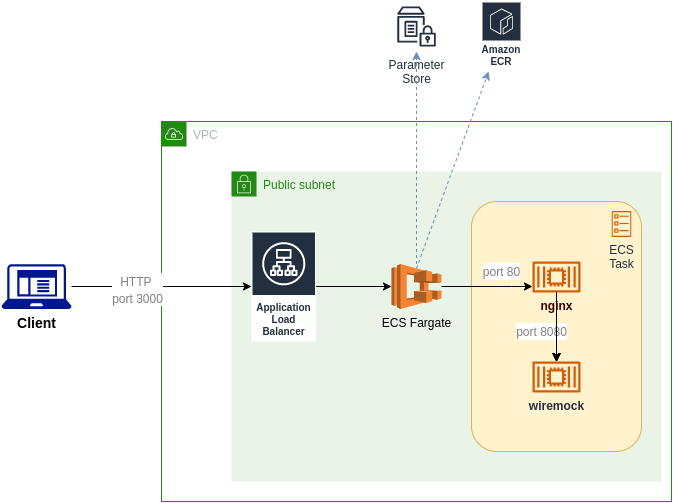
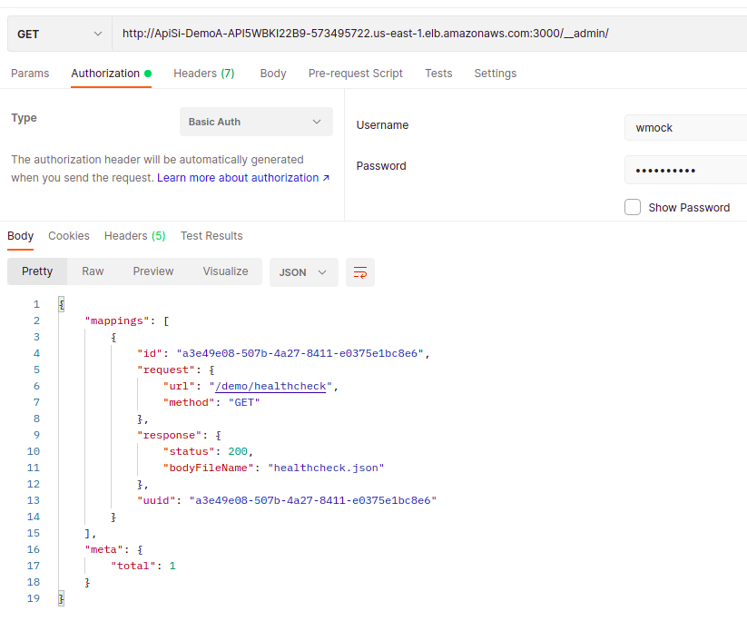
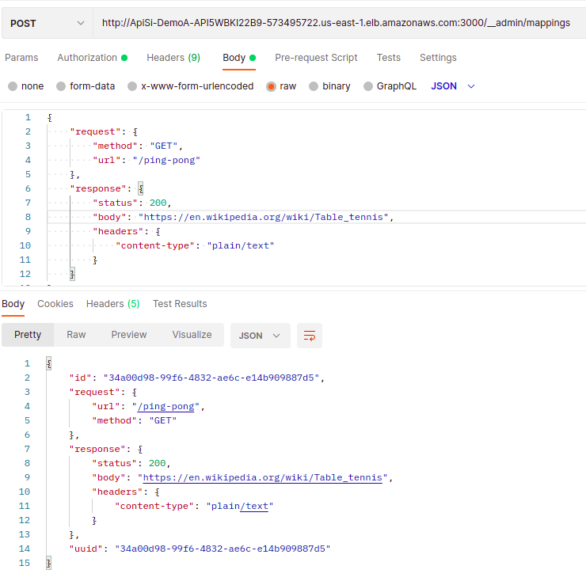
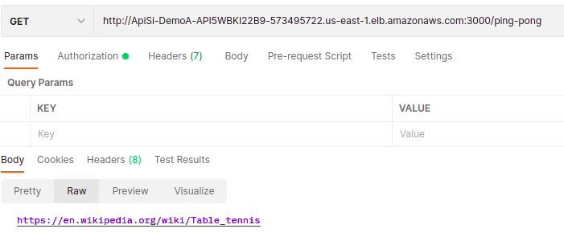

# Sample WireMock CDK Deployment as ECS Fargate Service

## Goal

This project demonstrates how to deploy WireMock API simulator (http://wiremock.org/) in AWS using CDK.
We added Basic Authentication for the Admin API (http://wiremock.org/docs/api/) by utilizing nginx proxy container.

Note, this is project is meant to be used as a reference only and you will need to enhance it to meet your security or functional requirements (e.g. disabling Internet access or using the encryption for credentials stored in AWS Parameter Store).

## AWS Deployment Diagram

A diagram below describes AWS deployment architecture:



## Project Structure

This repository contains three main folders:
- auth-proxy with nginx proxy container artifacts
- wiremock with WireMock container configuration
- deployment folder with CDK application which deploys both containers above as a service in ECS Fargate

You can create static mock requests definitions and add them to wiremock/configuration folder, similar to how a healthcheck request has be defined (GET /demo/healthcheck).


## Deploy

#### Add credentials to SSM Parameter Store:

```
$  aws ssm put-parameter --name /demo/wiremock-admin-username --value  "wmock" --type String --region us-east-1
  
$  aws ssm put-parameter --name /demo/wiremock-admin-password --value  "Password#1" --type String --region us-east-1
```

Deploy ECS Service:
``` 
$ cd ../deployment; npm i
$ cdk deploy LambdaStack
```

API Gateway Endpoint URL can be copied from the stack output.

### Test WireMock Deployment

### Admin API - Get mappings


### Admin API - Define new mapping


### Admin API - Test new mapping



DISCLAIMER: This project, code samples and the documentation are provided "as is" without warranty of any kind, either express or implied. Use at your own risk.

We make makes no warranty that

- the software will meet your requirements
- the software will be uninterrupted, timely, secure or error-free
- the results that may be obtained from the use of the software will be effective, accurate or reliable
- the quality of the software will meet your expectations
- any errors in the software obtained from us will be corrected.

We assume no responsibility for errors or omissions in the software or documentation.